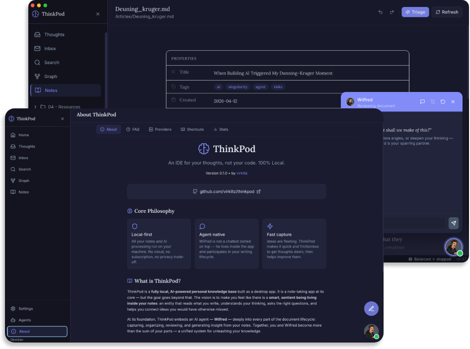

<p align="center">
  <picture>
    
  </picture>
</p>

<h1 align="center">ThinkPod</h1>
<p align="center"><b>IDE for your thought, not your code</b><br>Personal Knowledge Management, with built in AI Agents. 100% Local. Run on 8GB VRAM </p>

<p align="center">
  
  
</p>

<p align="center">
  <a href="mailto:junkim.dot@gmail.com">virkill@gmail.com</a> · <a href="https://omlx.ai/me">https://virkill.com</a>
</p>

<p align="center">
  <a href="#install">Install</a> ·
  <a href="#quickstart">Quickstart</a> ·
  <a href="#features">Features</a> ·
  <a href="#models">Models</a> ·
  <a href="#cli-configuration">CLI Configuration</a> ·
</p>

---

<p align="center">
  
</p>

> *Most note-taking apps treat AI as a *reactive* tool — you ask, it answers. ThinkPod flips this: the agent is *proactive*, running continuously, building its own understanding of your vault over time. This is not just a feature difference. It's a philosophical one.*
>
> *AI Agent should have agency. Wilfred live inside your Thinkpod, learn about you, bounce idea with you, and it can be 100% local, offline, and free.*


# ThinkPod

> An IDE for your thoughts, not your code. 100% Local.

ThinkPod is a **fully local, AI-powered personal knowledge base** built as a desktop app. It is a note-taking app at its core — but the goal goes beyond that. The vision is to make you feel like there is a **smart, sentient being living inside your notes**: an entity that reads what you write, understands your thinking, asks the right questions, and helps you connect ideas you would have otherwise missed. Together, you and Wilfred become more than the sum of your parts — a unified system for unleashing your knowledge.

At its foundation, ThinkPod embeds an AI agent — **Wilfred** — deeply into every part of the document lifecycle: capturing, organizing, reviewing, and generating insight from your notes.

---

## Core Philosophy

- **Local-first.** All your notes and AI processing run on your machine. No cloud, no subscription, no privacy trade-off.
- **Agent-native.** Wilfred is not a chatbot bolted on top — he lives inside the app and participates in the lifecycle of your writing.
- **Fast capture.** Ideas are fleeting. ThinkPod makes it as quick and frictionless as possible to get thoughts down, then helps you make them better.

---

## Why Local Changes Everything

Running 24/7 on a local model means:

- **No API cost accumulation** — the agent can run continuously without billing anxiety
- **Privacy** — the vault never leaves your machine; personal journals, family notes, sensitive ideas are safe
- **Autonomy** — no rate limits, no dependency on cloud uptime
- **True continuity** — the agent can take its time, revisit old conclusions

This makes the "always-on thinking partner" viable in a way that cloud-only tools cannot match.

---

## Features

### Writing & Document Management
- Markdown-based note editor with a file tree (your **Vault**)
- Drafts area for unfinished thoughts
- Documents organized into categories: **Journal**, **Ideas**, **Projects**, **People**, **Others**

### Wilfred — Your AI Agent
- Discuss any open document with Wilfred: summarize, edit, rewrite, critique, or just ask questions
- Wilfred is context-aware — when you open a note, he reads it automatically
- Wilfred can search the internet and surface relevant insights
- **Inbox:** Wilfred proactively sends you messages, research summaries, and suggestions
- Schedule Wilfred to run recurring tasks (triage, research, sorting) via **Tasks** and **Schedules**

### Voice Capture
- Dictate notes using local speech-to-text (powered by [Whisper](https://github.com/openai/whisper))
- Run it during a long meeting and convert everything heard into text
- Fully offline — audio never leaves your machine

### Privacy & Local AI
- Default model: **gemma4-e4b-it-4q** — a small, capable model that runs on an average MacBook, with support for vision, audio, and tool calls
- Alternatively, connect to any OpenAI-compatible API endpoint and model
- SQLite for local data; no telemetry

---

## Tech Stack

| Layer | Technology |
|-------|-----------|
| Shell | [Electron](https://www.electronjs.org/) |
| UI | React 19 + Tailwind CSS |
| Build | Vite |
| Database | better-sqlite3 (SQLite) |
| Voice | nodejs-whisper (local Whisper) |
| AI Runtime | Local model via OpenAI-compatible API (e.g. Ollama) |

---

## Installation

Download the latest release for your platform from [GitHub Releases](https://github.com/virkillz/thinkpod/releases):

### macOS
- Download the `.dmg` file
- Open the DMG and drag ThinkPod to your Applications folder
- Launch ThinkPod from Applications

### Windows
- Download the `.exe` installer
- Run the installer and follow the setup wizard
- Launch ThinkPod from the Start menu or desktop shortcut

### Linux
- Download the `.AppImage` file
- Make it executable: `chmod +x ThinkPod-*.AppImage`
- Run the AppImage: `./ThinkPod-*.AppImage`

---

## Notes:
This projects is developed and tested on Macbook Air M4 with 16GB RAM. 

For smoother experience, the recommended way to setup the AI LLM is not use the built in model but install oMLX (https://github.com/jundot/omlx) like ollama but for Apple Silicon machine, and use it as external by serving gemma-4-e4b-it-4bit.


From source:

## Getting Started

### Prerequisites
- Node.js 20+
- A local model server (e.g. [Ollama](https://ollama.com)) **or** an OpenAI-compatible API key

### Install & Run

```bash
npm install
npm run dev
```

### Build

```bash
npm run build
```

On first launch, the setup wizard will guide you through:
1. Pointing to your **Vault** (notes folder)
2. Configuring your **LLM** (local or remote)
3. Setting up **Voice** capture (optional)

---


